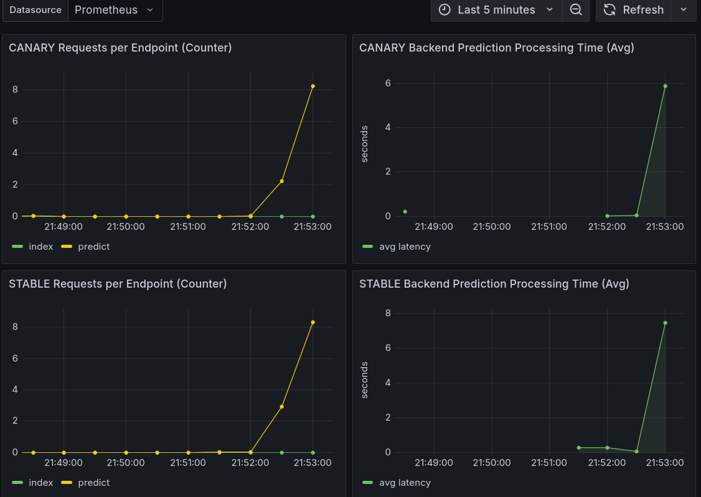

# Continuous Experimentation - Increased model service threads

We hypothesize that horizontally scaling the process-instance count of model-service pods will significantly reduce the average end-to-end latency under significant load.

The horizontal scaling in this experiment will be performed by increasing the count of processes within one pod. In a true deployment, the scaling should be done by scaling the pods instead of the processes. This would, amongst other things, allow for horizontal scaling beyond one node.

When the plan was hypothesized, we realized that the frontend was quite limited in the collection of metrics relevant to model-service requests. This is because the delay of requests to the model-service was aggregated over time, limiting the visualization possibilities. We transitioned to a graph showing the 95th, 90th, and median response times at various timepoints.

As there was currently not enough traffic, we created a simple synthetic traffic generator that was run on the guest OS. This increased the requests per second until there was a delay (signifying significant load).

Since the delay is expected to be load-dependent, the canary model service and stable model service should experience the same load for results to be easy to interpret in the dashboard. To achieve this, the load will temporarily be split 50/50 between stable and canary by manually pinning the version between the stable and the canary.

To run the tests the following is done:
1. An image of model service is build with the threads that model-service uses increased to 16 threads from the default 4 threads.
2. During 60 seconds 10 requests per second are send to the stable model service and canary model service using the pinned versions using [bombardier](https://github.com/codesenberg/bombardier).
3. In the dasbhoard the results of the different latency counts are compared. 

We define the success criteria to be a reduction in maximum processing time of at least 5%. In the dashboard shown below, this is represented by the highest point in the prediction processing time graph.

Below a screenshot of the Grafana dashboard can be seen.  .

The results indicate that increasing the thread count for the model service yields a measurable impact on backend prediction latency. While the improvement is relatively modest, the processing time decreased from approximately 8 seconds to 6 seconds. This reduction is greater than 5%; therefore, we deem the experiment a success.