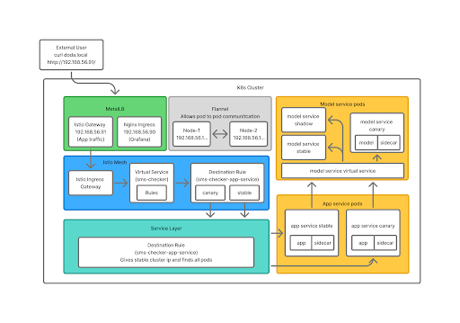

### Deployment Structure and Data Flow

## 1. Overview
This document describes how the SMS-checker system is deployed on Kubernetes using an Istio service mesh. It explains:
- The deployed components and resources (Kubernetes + Istio)
- How external traffic reaches the application
- How canary routing is implemented (90/10 split and header-based routing)
- How the shadow launch use case is applied.

## 2. Provisioning
The provisioning for the Kubernetes cluster is handled in the `operation` repository under:

- `operation/infrastructure/`
  - `Vagrantfile` (VM setup)
  - `ansible/` (cluster provisioning automation)

Provisioning includes:
- bringing up the cluster nodes using Vagrant
- installing and configuring Kubernetes via Ansible playbooks
- installing basic infrastructure components needed to deploy applications

## 3. Infrastructure

### 3.1 Kubernetes Cluster
A Kubernetes cluster is created using:
- Vagrant for VM creation
- Ansible playbooks for Kubernetes installation/configuration

The infrastructure setup defines:
- control plane and worker node setup
- kubeconfig/admin configuration
- networking components

### Controller Node and Worker Nodes

The Kubernetes cluster consists of one controller node and multiple worker nodes. The controller node manages the cluster by running the Kubernetes control plane and shared services such as Istio and the monitoring stack (Prometheus, Alertmanager, and Grafana). 
The worker nodes run the application workloads, including the stable and canary versions of the app-service and model-service. 
They receive traffic routed by Istio and handle request processing and model inference, while the controller node coordinates scheduling and overall cluster operation.


### 3.2 Infrastructure Add-ons (Cluster Capabilities)
A Kubernetes cluster by itself provides the core functionality for deploying and managing applications (Pods, Deployments, Services, etc.), but several additional components are utilized to make the cluster usable in practice.  
This project relies on the following infrastructure add-ons, which extend the cluster with networking, load balancing, observability, and service mesh capabilities.


#### 3.2.1 Flannel (CNI / Pod Networking)
**Flannel** is used as the cluster’s CNI (Container Network Interface) implementation. Kubernetes requires a CNI plugin to enable communication between Pods across nodes.

- Assigns Pod IP ranges and ensures Pods can communicate across nodes.
- Provides the networking layer that Kubernetes requires for Pod-to-Pod traffic.

#### 3.2.2 MetalLB (LoadBalancer on Bare-Metal)
In a local environment, Kubernetes does not have this capability by default. This is solved using **MetalLB**.

- Implements the `LoadBalancer` Service type in bare-metal Kubernetes environments.
- Assigns external IP addresses to Services (from a configured pool).
- Makes it possible to expose services externally in a clean Kubernetes-native way.

#### 3.2.3 Istio (Service Mesh)
**Istio** is deployed as the project’s service mesh. It adds an additional communication layer on top of Kubernetes networking by injecting Envoy sidecars into Pods.

Istio extends Kubernetes with advanced traffic management and security features, including:
- request routing (VirtualService)
- version subsets and traffic splitting (DestinationRule)
- ingress gateway capabilities (Gateway + IngressGateway)
- observability and telemetry (traffic metrics, tracing support)
- traffic mirroring (shadow launch)

Istio is the core component enabling continuous experimentation:
- canary releases (90/10 stable/canary split)
- explicit routing via headers (`x-version`)
- consistent service version routing through subsets
- shadow launch (mirroring traffic to canary without impacting user responses)

#### 3.2.4 Prometheus + Alerting (Metrics Collection and Notifications)
The project uses **Prometheus** for metrics collection and **Alertmanager** for alerting. Application metrics are exposed by the app-service via an HTTP endpoint:

- **Metrics endpoint:** `GET /metrics`

Prometheus periodically scrapes this endpoint and stores the values as time-series data. Alerts are evaluated using Prometheus alerting rules and are forwarded to Alertmanager for notification handling.

##### Metrics exposed by app-service (/metrics)
The following metrics are exported in Prometheus text format by `MetricsController`:

1) `index_requests_total` *(counter)*  
Total number of index/root requests.

2) `predict_requests_total` *(counter)*  
Total number of prediction requests.

3) `active_users{page="<page>"}` *(gauge)*  
Number of active users per page.

4) `prediction_latency_seconds_count` *(summary count)*  
Number of recorded prediction latency observations.

5) `prediction_latency_seconds_sum` *(summary sum)*  
Total accumulated prediction latency in seconds.

6) `ui_request_duration_seconds_bucket{endpoint="<endpoint>",method="<method>",status="<status>",le="<bucket>"}` *(histogram bucket)*  
UI request duration histogram bucket counts.

7) `ui_request_duration_seconds_count{endpoint="<endpoint>",method="<method>",status="<status>"}` *(histogram count)*  
Total request count per endpoint/method/status label set.

8) `ui_request_duration_seconds_sum{endpoint="<endpoint>",method="<method>",status="<status>"}` *(histogram sum)*  
Total accumulated request duration per endpoint/method/status label set.

Bucket boundaries used:
- `0.1`, `0.3`, `0.5`, `1.0`, `2.0`, `5.0`, and `+Inf`

Source:
- `MetricsController.java`


#### Alertmanager configuration (Discord notifications)
Alert notifications are handled using a custom **AlertmanagerConfig** resource:

- Kind: `AlertmanagerConfig`
- Name: `<release-name>-discord-config`
- Deployed only if monitoring is enabled (Helm conditional):
  - `.Values.monitoring.enabled == true`

The configuration defines:

**Receiver**
- Receiver name: `discord`
- Uses `discordConfigs` with a webhook stored in a Kubernetes Secret:
  - Secret name: `alertmanager-discord-webhook`
  - Secret key: `webhook-url`
- `sendResolved: true`  
  This ensures that both firing and resolved alerts are sent to Discord.

**Message formatting**
- Alert title format:
  - `STATUS: <summary>`
- Alert message body:
  - `<description>`

**Routing rules**
All alerts are routed to the Discord receiver with:
- `groupBy: ['alertname']`  
  Alerts with the same `alertname` are grouped together.
- `groupWait: 10s`  
  First alert in a group waits 10 seconds before sending (allows grouping).
- `groupInterval: 10s`  
  Minimum interval between updates to an existing alert group.
- `repeatInterval: 12h`  
  A still-firing alert is resent every 12 hours.

### Prometheus Alert Rule (High Request Rate)


A Prometheus alert rule is defined to detect unusually high traffic on the application:


```yaml
- alert: HighRequestRate
expr: sum(rate(index_requests_total[1m])) * 60 > 15
for: 2m
```

The threshold of **15 requests per minute** was chosen because normal traffic to the application is low. The `for: 2m` condition ensures the alert only triggers when the increase in traffic is sustained, helping avoid alerts caused by short spikes.


#### 3.2.5 Grafana (Dashboards and Visualization)
The project uses **Grafana** for observability dashboards and visualization of Prometheus metrics.

Grafana provides the “UI layer” for monitoring:
- connects to Prometheus as a data source
- visualizes metrics as dashboards (graphs, counters, heatmaps, etc.)
- supports filtering and drill-down (per service, per pod, per namespace)

The Helm chart includes custom dashboards, such as:
- `app-metrics.json`
- `system-metrics.json`

## 4. Deployment Architecture

### 4.1 Services
The deployed system consists of two services:

- **app-service**  
  Entry point for users. Serves the web UI and exposes the HTTP endpoints used by the UI. It forwards prediction requests to the model-service and exposes the /metrics endpoint for Prometheus.

- **model-service**  
  Provides the prediction endpoint. Loads the trained model artifact and returns inference results to the app-service. It is only reachable internally (not exposed directly to the outside).

Project repositories:
- `app-service`
- `model-service`
- `lib-version`
- `operation`


### 4.2 Helm Chart Structure
Deployment is managed through the Helm chart located at:

- `operation/SMS-checker/`

This Helm chart deploys:
- Kubernetes Deployments and Services for the app-service and model-service
- Istio Gateway, VirtualService, DestinationRules
- monitoring stack (Prometheus/Grafana dashboards + alerting config)

### 4.3 Request Flow


1. **External User**
- Sends a request to the configured hostname (for example: `curl doda.local`), which resolves to the MetalLB IP.


2. **MetalLB**
- Receives the request and forwards it to the Istio Gateway service (App traffic IP).


3. **Istio Ingress Gateway**
- Traffic enters the cluster and the Istio mesh through the Istio Ingress Gateway.


4. **VirtualService (sms-checker)**
- Applies routing rules and forwards traffic to `app-service`.


5. **DestinationRule (sms-checker-app-service)**
- Selects the target subset:
- Routes to **stable** app-service pods, or
- Routes to **canary** app-service pods.


6. **App Service Pods**
- The selected app-service pod (with sidecar) receives the request.
- It forwards prediction requests to the model-service VirtualService.


7. **Model-Service VirtualService**
- Routes traffic to model-service subsets:
- **stable** (production inference),
- **canary** (candidate version),
- **shadow** (receives mirrored traffic for evaluation, if configured).


8. **Model Service Pods**
- The chosen model-service pod performs inference and returns results to app-service.


9. **Response to User**
- app-service returns the final response back through:
- Istio Ingress Gateway
- MetalLB
- External User




### 4.4 Configuration and Secrets


Configuration is externalized to keep deployments portable and secure:


- **ConfigMaps** store non-sensitive configuration (ports, service endpoints, hostnames).
- **Secrets** store sensitive values (for example alerting webhooks).


Key configuration (like hostnames) is controlled via Helm values.yaml to support installation on other clusters without changing templates.

