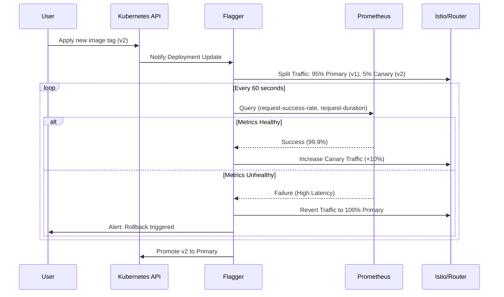

# Extension Proposal: Automated Canary Deployments with Flagger

## 1. Identified Shortcoming: Manual Verification of Deployments

### The Problem
Currently, the "release verification" process in our project is entirely manual and reactive. After a deployment (`helm install`/`upgrade`), the engineer must:
1.  Manually generate synthetic traffic (e.g., `curl` loops).
2.  Visually inspect Grafana dashboards to spot anomalies in error rates or latency.
3.  Manually rollback (re-run `helm` or `kubectl rollout undo`) if issues are detected.

### The Effect
*   **High Mean Time to Recovery (MTTR):** As experienced during our own debugging, relying on human eyes to spot "empty dashboards" or "latency spikes" is slow. A bad release can sit in production for minutes or hours before being noticed.
*   **Error-Prone:** It is easy to misinterpret a query (e.g., looking at `rate()` over the wrong interval) or miss a subtle regression in tail latency (`p99`).
*   **Inconsistent Quality Gates:** The criteria for a "good release" are in the engineer's head, not defined as code.

In a modern DevOps environment, monitoring dashboards manually to verify a deployment is an bottleneck issue. Our current Prometheus setup detects issues, but the deployment controller is unaware of them.

---

## 2. Proposed Extension: Automated Canary Analysis (ACA)

We propose moving from a "Manual Deployment" model to a **Progressive Delivery** model using **Flagger**. This applies a general, industry-standard pattern that decouples deployment from release, applicable to any microservice architecture beyond this specific project.

### The Solution
Flagger will act as an operator in our Kubernetes cluster. Instead of instantly shifting 100% of traffic to the new version, Flagger will:
1.  Detect a new deployment of `app-service`.
2.  Spin up the new version alongside the old one (Canary vs. Primary).
3.  Gradually shift traffic (e.g., 5% -> 10% -> 50%) using Istio or K8s Networking.
4.  **Automatically query our Prometheus metrics** (Success Rate, Latency) at every step.
5.  **Halt and Rollback** automatically if metrics deviate from the threshold.

### Visualization of the Refactored Process

---

## 3. Concrete Implementation Tasks (1-3 Days)

This extension is implementable as the next assignment with the following steps:

1.  **Infrastructure Setup (Day 1)**:
    *   Install **Flagger** and the **Prometheus Provider** in the `monitoring` namespace.
    *   Ensure **Istio** (or a compatible Ingress Controller) is active for traffic splitting.

2.  **Define Metric Templates (Day 1-2)**:
    *   Create `MetricTemplate` resources that map to our exact Prometheus queries:
        *   `index_requests_total` rate > 99% success.
        *   `ui_request_duration_seconds_bucket` p99 < 500ms.

3.  **Refactor Helm Chart (Day 2)**:
    *   Create a `Canary` Custom Resource Definition (CRD) in `operation/SMS-checker/templates/canary.yaml`.
    *   Remove manual Service definitions in favor of Flagger-managed services (`.spec.service.name` becomes the target).

4.  **Traffic Generation (Day 3)**:
    *   Implement an automated load generator (using `k6` or `hey`) as a sidecar or Job that runs during analysis to ensure metrics are populated (solving the "no traffic = no metrics" issue we faced).

---

## 4. Expected Outcome & Benefits

*   **Metric-Driven Decisions:** The release process becomes purely data-driven. If the `prediction_latency` spikes, the release fails. No argument.
*   **Safety:** Bad releases are caught at 5-10% user impact rather than 100%.
*   **Codified Reliability:** SLOs (Service Level Objectives) are defined in Git (`canary.yaml`), not in a wiki or dashboard.

### Measuring the Effect (Experiment Design)
To prove the design works, we will run the following experiment:

1.  **Baseline:** Deploy a version of `app-service` that introduces a `Thread.sleep(2000)` (2 seconds latency).
    *   *Old Way:* Deploy. Watch Dashboards. Measure time until human notices and runs `helm rollback`. (Expected: ~2-5 mins).
2.  **Test:** Deploy the same "slow" version with Flagger enabled.
    *   *New Way:* Flagger detects `latency > 500ms` during the 5% traffic phase.
    *   *Measurement:* Flagger immediately reverts traffic. (Expected: < 1 min, automated).

---

## 5. Assumptions & Downsides
*   **Complexity:** Adds a new controller (Flagger) and requires a Service Mesh/Ingress Controller (Istio/Nginx). Debugging "why did the canary fail?" requires inspecting Flagger events/logs, adding a layer of abstraction.
*   **Resource Usage:** During deployment, both V1 and V2 run simultaneously, temporarily doubling resource consumption for that service.

---