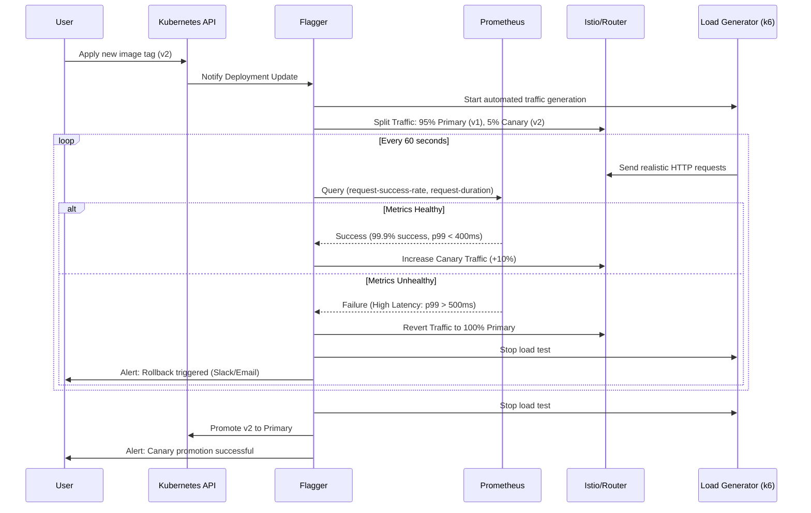

# Extension Proposal: Automated Canary Deployments with Flagger

## 1. Identified Shortcoming: Manual Verification of Deployments

### The Problem
Currently, the "release verification" process in our project is entirely manual and reactive. After a deployment (`helm install`/`upgrade`), the engineer must:
1.  Manually generate synthetic traffic (e.g., `curl` loops).
2.  Visually inspect Grafana dashboards to spot anomalies in error rates or latency.
3.  Manually rollback (re-run `helm` or `kubectl rollout undo`) if issues are detected.

### The Effect

This manual verification approach creates several critical problems that compound to significantly degrade our deployment reliability and operational efficiency:

*   **High Mean Time to Recovery (MTTR):** As experienced during our own debugging sessions, relying on human observation to spot "empty dashboards" or "latency spikes" introduces substantial delays. A bad release can sit in production affecting 100% of users for minutes or even hours before being noticed and rolled back. During this window, user experience degrades, error rates spike, and potential data corruption or service outages can occur. The time between deployment and detection is purely dependent on when an engineer happens to check the dashboard.

*   **Error-Prone Interpretation:** Manual metric analysis is inherently unreliable. Engineers can easily misinterpret Prometheus queries. Subtle regressions in tail latency or specific error conditions might be dismissed as "noise" or simply overlooked in a busy dashboard. Different engineers may interpret the same metrics differently, leading to inconsistent deployment decisions.

*   **Inconsistent Quality Gates:** The criteria for what constitutes a "good release" exist only in the engineer's mental model, not as executable code. One engineer might accept a 1% error rate increase as "acceptable variance," while another might consider it a critical regression. This lack of standardization means deployment quality depends on who is performing the verification, creating unpredictable outcomes and making it impossible to enforce consistent SLOs (Service Level Objectives).

*   **Manual Traffic Generation Overhead:** Perhaps the most tedious aspect is the need to manually generate synthetic traffic using `curl` loops or similar tools just to populate metrics for observation. This introduces several problems:
    *   **Time-Consuming:** Engineers must write and execute curl commands, wait for sufficient data points to accumulate in Prometheus (typically 1-5 minutes), and then check if the metrics look correct.
    *   **Non-Representative Load:** Manual curl loops rarely simulate realistic user behavior patterns, traffic volumes, or edge cases. A simple `while true; do curl ...; sleep 1; done` doesn't test concurrent requests, varying payload sizes, or realistic user workflows.
    *   **Forgotten or Inconsistent:** Under pressure to deploy quickly, engineers might skip traffic generation entirely or run it for insufficient duration, leading to false confidence in a deployment that hasn't been properly exercised.
    *   **No Baseline Comparison:** Manual testing doesn't automatically compare new version metrics against the old version's baseline, making it difficult to detect relative performance degradation.

*   **Lack of Repeatability and Auditability:** Manual processes cannot be reliably reproduced. There's no audit trail showing exactly what tests were run, what metrics were checked, or what thresholds were applied. This makes post-incident analysis difficult and prevents continuous improvement of the verification process.

In a modern DevOps environment, relying on manual dashboard monitoring to verify deployments is a critical bottleneck. Our current Prometheus setup successfully detects and records issues, but the deployment controller remains completely unaware of them—there's no feedback loop between observability and deployment decisions. This disconnect means we're collecting valuable signals but failing to act on them automatically.

---

## 2. Proposed Extension: Automated Canary Analysis (ACA)

We propose moving from a "Manual Deployment" model to a **Progressive Delivery** model using **Flagger**. This applies a general, industry-standard pattern that decouples deployment from release, applicable to any microservice architecture beyond this specific project.

### The Solution

Flagger will act as an operator in our Kubernetes cluster. Instead of instantly shifting 100% of traffic to the new version, Flagger will:
1.  Detect a new deployment of `app-service`.
2.  Spin up the new version alongside the old one (Canary vs. Primary).
3.  Gradually shift traffic (e.g., 5% -> 10% -> 50%) using Istio or K8s Networking.
4.  **Automatically query our Prometheus metrics** (Success Rate, Latency) at every step.
5.  **Halt and Rollback** automatically if metrics deviate from the threshold.

### How This Mitigates the Identified Problems

**1. Eliminates Manual Traffic Generation:**
The most immediate improvement is the complete elimination of manual `curl` loops. Flagger integrates with automated load testing tools (such as `k6`, `hey`, or `Gatling`) that run as Kubernetes Jobs during the canary analysis phase. This means:
*   **Automated Execution:** Traffic generation starts automatically when a new deployment is detected—no engineer intervention required.
*   **Realistic Load Patterns:** Load testing tools can simulate realistic user behavior with configurable request rates, concurrent users, varied payloads, and complex user journeys (e.g., GET `/` → POST `/sms/` → GET `/metrics`).
*   **Consistent Testing:** Every deployment receives the same standardized load test, ensuring fair comparison between versions.
*   **Sufficient Data Volume:** The load generator runs for the entire duration of the canary analysis (typically 5-10 minutes), ensuring Prometheus has ample data points for statistically significant metric evaluation.

Instead of an engineer manually running `while true; do curl ...; done` and hoping they've generated enough traffic, Flagger orchestrates a proper load test that exercises both the canary and primary versions simultaneously, providing real comparative data.

**2. Reduces MTTR Through Automated Detection:**
Flagger continuously polls Prometheus metrics every 60 seconds during the canary phase. If the canary version exhibits degraded performance (e.g., error rate > 1%, p99 latency > 500ms), Flagger immediately reverts traffic to the primary version—typically within 1-2 minutes of the issue manifesting. This is orders of magnitude faster than waiting for a human to notice a problem in a dashboard.

**3. Eliminates Interpretation Errors:**
Metric thresholds are defined declaratively in the `Canary` resource's `MetricTemplate`. For example:
```yaml
thresholdRange:
  min: 99  # Success rate must be >= 99%
```
This removes human judgment from the equation. The same Prometheus query runs identically for every deployment, and the same threshold is applied consistently. There's no room for misinterpreting `rate()` intervals or dismissing anomalies as noise.

**4. Codifies Quality Gates:**
SLOs are now version-controlled in Git as part of the `canary.yaml` configuration. The entire team agrees on what "good" looks like (e.g., `p99 < 500ms`, `success_rate > 99%`), and these criteria are enforced automatically. Changes to quality gates go through code review, creating accountability and preventing ad-hoc decision-making.

**5. Provides Auditability and Repeatability:**
Every canary deployment generates Kubernetes events and Flagger logs that document:
*   What metrics were evaluated
*   What values were observed
*   Why a promotion succeeded or failed
*   Exact timestamps of each traffic shift

This creates a complete audit trail for post-incident analysis and enables continuous refinement of the deployment process based on historical data.

### Visualization of the Refactored Process



---

## 3. Concrete Implementation Tasks (1-3 Days)

This extension is implementable as the next assignment with the following steps:

1.  **Infrastructure Setup (Day 1)**:
    *   Install **Flagger** and the **Prometheus Provider** in the `monitoring` namespace.
    *   Ensure **Istio** (or a compatible Ingress Controller) is active for traffic splitting.

2.  **Define Metric Templates (Day 1-2)**:
    *   Create `MetricTemplate` resources that map to our exact Prometheus queries:
        *   `index_requests_total` rate > 99% success.
        *   `ui_request_duration_seconds_bucket` p99 < 500ms.

3.  **Refactor Helm Chart (Day 2)**:
    *   Create a `Canary` Custom Resource Definition (CRD) in `operation/SMS-checker/templates/canary.yaml`.
    *   Remove manual Service definitions in favor of Flagger-managed services (`.spec.service.name` becomes the target).

4.  **Traffic Generation (Day 3)**:
    *   Implement an automated load generator (using `k6` or `hey`) as a sidecar or Job that runs during analysis to ensure metrics are populated (solving the "no traffic = no metrics" issue we faced).

---

## 4. Expected Outcome & Benefits

*   **Metric-Driven Decisions:** The release process becomes purely data-driven. If the `prediction_latency` spikes, the release fails. No argument.
*   **Safety:** Bad releases are caught at 5-10% user impact rather than 100%.
*   **Codified Reliability:** SLOs (Service Level Objectives) are defined in Git (`canary.yaml`), not in a wiki or dashboard.

### Measuring the Effect (Experiment Design)
To prove the design works, we will run the following experiment:

1.  **Baseline:** Deploy a version of `app-service` that introduces a `Thread.sleep(2000)` (2 seconds latency).
    *   *Old Way:* Deploy. Watch Dashboards. Measure time until human notices and runs `helm rollback`. (Expected: ~2-5 mins).
2.  **Test:** Deploy the same "slow" version with Flagger enabled.
    *   *New Way:* Flagger detects `latency > 500ms` during the 5% traffic phase.
    *   *Measurement:* Flagger immediately reverts traffic. (Expected: < 1 min, automated).

---

## 5. Assumptions & Downsides
*   **Complexity:** Adds a new controller (Flagger) and requires a Service Mesh/Ingress Controller (Istio/Nginx). Debugging "why did the canary fail?" requires inspecting Flagger events/logs, adding a layer of abstraction.
*   **Resource Usage:** During deployment, both V1 and V2 run simultaneously, temporarily doubling resource consumption for that service.

---